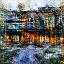

# Architexa's AI Image Generator API

This project implements an AI model for generating images of houses. The AI model was trained by our team and is exposed through a Flask-based API, which is deployed on a web application hosted on Render.

## Live 
Check it out!
https://architexa.io/pages/home.html

## Table of Contents
1. [Project Overview](#project-overview)
2. [Model Architecture](#model-architecture)
3. [API Endpoints](#api-endpoints)
4. [Demo](#demo)
5. [Running Locally](#running-locally)

## Project Overview

The AI House Image Generator API generates images of houses using a trained neural network model. The model is built using TensorFlow and Keras. It takes a random noise input, conditioned with a label, to generate images of different styles of houses. The web app provides an API endpoint to send prompts and receive the generated images.

## Model Architecture

The AI model is a generator neural network with multiple transposed convolutional layers, followed by batch normalization and LeakyReLU activations. The model generates images by taking random noise and label input and outputting 128x128 RGB images. The model was trained using GAN techniques and the pre-trained weights are loaded from `generator.h5`.

### Generator Architecture:
- Input: Noise vector of dimension 128
- Label embedding: Categorical embedding with label input
- Layers: Multiple Conv2DTranspose layers with increasing resolution
- Output: 128x128 RGB image

## API Endpoints

### `POST /hi`

**Description**: This endpoint generates a house image and returns it as a base64-encoded JPEG image called test.

## Demo 

Here is an example of what the model outputs 




## Running Locally

### Prerequisites

1. Install Python 3.8 or later.
2. Install necessary dependencies by running:

   ```bash
   pip install -r requirements.txt
   ```

### Running the Application
``` bash
python main.py
```
